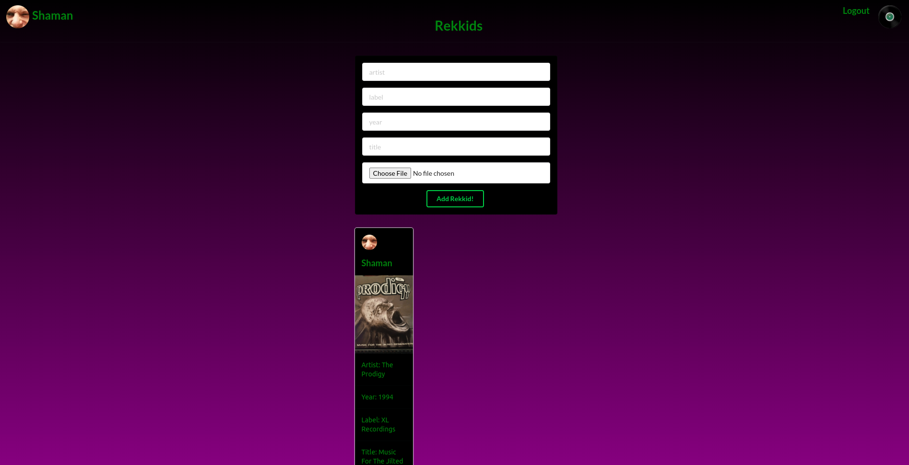
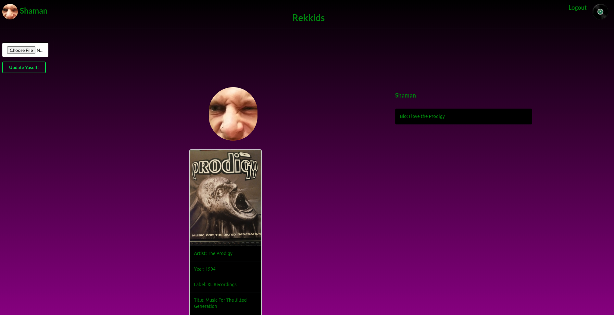

# Rekkids
This is an instagram-like app for sharing photos of your vinyl records.
Social media aspects allow for a deeper look into the minds of collectors.
Simple UI for easy navigation provides a more user friendly experience.

< br>
 

### Technologies Used
- AWS
- CSS
- HTML
- Node
- Atlas
- React
- Heroku
- Mongoose
- Javascript
- Semantic UI

### Getting Started
- [Start Collecting!](https://rekkidsgram.herokuapp.com/)
- [Trello Board](https://trello.com/b/xoIsMbxu/rekkids-mern)

### Additions I'd Like to Make
- The ability to sort posts by artist.
- The ability to add videos.
- The ability to follow other users. 
- Some sort of third party API like Last.fm, Spotify, etc. 

